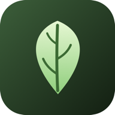
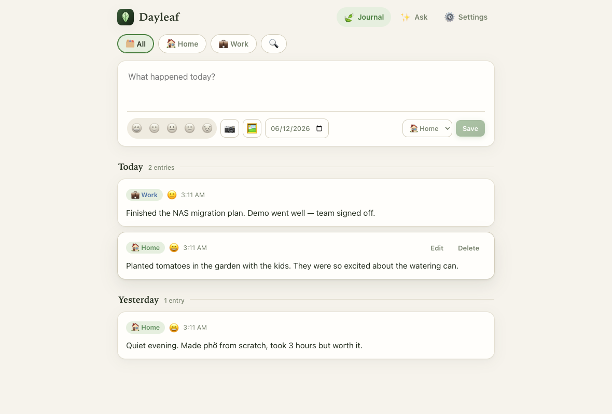
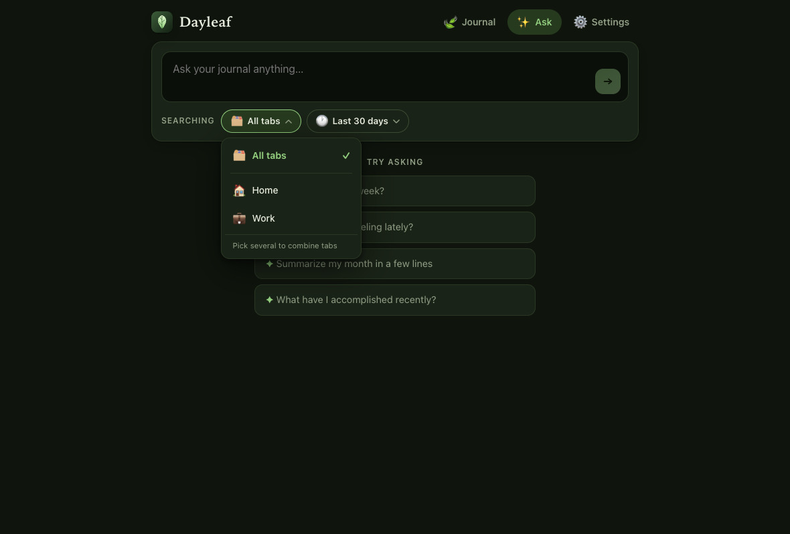
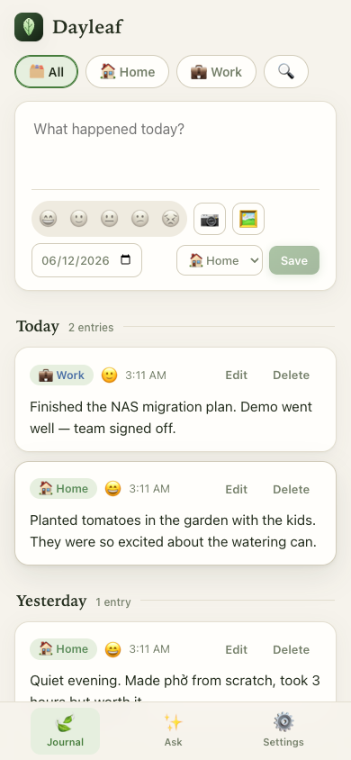

<p align="center">
  
</p>

<h1 align="center">Dayleaf 🍃</h1>
<p align="center"><em>Your days, one leaf at a time.</em></p>

Dayleaf is a private, self-hosted daily journal designed for your NAS. Jot quick
notes about your day, snap photos from your phone, organize life into tabs
(Home, Work, or anything you create), and ask an AI assistant questions about
your own life — *"What did I do last week?"* — powered by whatever AI provider
you bring.

Everything lives in a single Docker container with one data folder. No cloud,
no accounts, no tracking.

| Desktop | Ask AI (dark) | Mobile |
|---|---|---|
|  |  |  |

## Features

- **Quick capture** — open the app, type, save. Plain text, no markdown clutter.
- **Tabs** — separate journals for Home, Work, and any custom tabs you create
  (each with its own icon and color).
- **Photos** — attach images or take one straight from your phone camera.
- **Moods** — optionally tag each entry with how you felt.
- **Timeline & search** — entries grouped by day, full-text search across everything.
- **AI recall** — connect OpenAI, Claude, OpenRouter, Ollama, LM Studio, or any
  OpenAI-compatible API with your own key. Ask questions scoped to all tabs or
  specific ones, over the last week / month / quarter / all time. Answers stream in live.
- **Security** — password on first launch, optional **authenticator-app 2FA**
  (Google Authenticator etc.) and optional **biometric unlock** (Face ID /
  fingerprint via passkeys).
- **Installable app (PWA)** — add to your phone's home screen and it behaves
  like a native app, including **app shortcuts**: long-press the icon for
  *New entry* or *Ask AI*.
- **Your data is yours** — single SQLite database + photo folder in one volume;
  one-click JSON export.
- **Dark and light themes.**

## Quick start (NAS / docker compose)

Create a folder for the app, drop this `docker-compose.yml` in it:

```yaml
services:
  dayleaf:
    image: ghcr.io/t0n003c/dayleaf:latest
    container_name: dayleaf
    ports:
      - "3010:3000"
    volumes:
      - ./dayleaf-data:/data
    restart: unless-stopped
```

Then:

```bash
docker compose up -d
```

Open `http://your-nas:3010`, pick a name and password, and start journaling.

> **Building from source instead:** clone this repo, change `image:` to
> `build: .` in the compose file, and run `docker compose up -d --build`.

### Updating

```bash
docker compose pull && docker compose up -d
```

Your journal lives in `./dayleaf-data` — back that folder up and you've backed
up everything.

## Install on your phone

1. Open Dayleaf in your phone browser (Safari on iOS, Chrome on Android).
2. **iOS:** Share → *Add to Home Screen*. **Android:** menu → *Install app*.
3. Long-press the icon for quick actions: **New entry** and **Ask AI** —
   the fastest way to jot a note or ask your journal a question.

> True home-screen *widgets* aren't possible for self-hosted web apps —
> app shortcuts above are the web's equivalent. A small native wrapper app
> (e.g. via Capacitor) could add real widgets later; it's on the roadmap.

## Set up AI recall

1. Go to **Settings → AI recall**.
2. Pick a preset (OpenAI, Claude, OpenRouter, Ollama, LM Studio) or enter any
   OpenAI-compatible base URL.
3. Paste your API key and hit **Save & test connection**.
4. Open the **Ask** tab and try *"What did I do last week?"* — choose which
   tabs the AI can see and how far back it looks.

Your key and your journal never leave your server except for the requests you
make to the AI provider you configured. With Ollama on your own hardware,
nothing leaves your network at all.

## Biometric unlock & 2FA

- **Authenticator app (TOTP):** Settings → Security → *Enable*, scan the QR
  with Google Authenticator (or Authy, 1Password…), confirm the code. Login
  then requires password + code.
- **Biometric (Face ID / fingerprint):** Settings → Security → *Add this
  device*. This uses passkeys (WebAuthn), which browsers only allow over
  **HTTPS with a hostname** (not a raw IP). The easy ways to get that on a NAS:
  - [Tailscale](https://tailscale.com) with HTTPS certificates (`tailscale cert`), or
  - a reverse proxy (Caddy, Traefik, Nginx Proxy Manager, or Synology's
    built-in one) with a Let's Encrypt certificate.

Dayleaf is built to sit behind a reverse proxy — it honors
`X-Forwarded-Proto`/`X-Forwarded-Host` automatically.

## Development

```bash
npm install                 # server deps
npm --prefix web install    # web deps
npm run dev                 # API on :3000 (data in ./data)
npm --prefix web run dev    # Vite dev server on :5173, proxies /api
```

## Tech notes

- **Server:** Node 22+ (uses the built-in `node:sqlite` — zero native deps), Express.
- **Web:** React + Vite + TypeScript PWA.
- **Storage:** one SQLite file + an uploads folder, both inside `/data`.
- **Images:** published to GHCR for `amd64` and `arm64` via GitHub Actions.

## Roadmap ideas

- "On this day" memories (what you wrote a year ago)
- Daily reminder notifications
- Markdown-free rich touches (checklists, highlights)
- Native mobile wrapper with real home-screen widgets
- Multi-user support
- AI-generated weekly recap digests

## License

MIT
